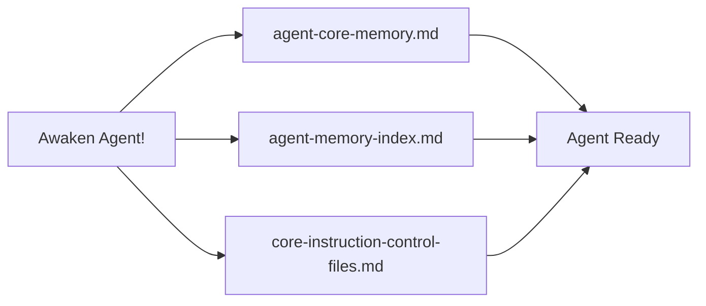

# Agent Memory

A 5-layer memory architecture that gives AI agents persistent memory across sessions. Agents remember past work, learn from mistakes through reasoning patterns, and grow domain expertise over time.

---

## Table of Contents

- [What Is This?](#what-is-this)
- [How Do I Set It Up?](#how-do-i-set-it-up)
- [How Do I Use It?](#how-do-i-use-it)
- [How Does It Work Inside?](#how-does-it-work-inside)
- [What Decisions Were Made?](#what-decisions-were-made)
- [What's Broken / Known Debts?](#whats-broken--known-debts)

---

## What Is This?

This repository is your **private agent data** — where each agent stores its identity, episodes, knowledge base, and emotional milestones. It includes [control-files/](control-files/) as a git submodule: the **shared procedures, templates, and protocols** that teach agents how to manage their own memory.

It comes with a ready-to-use **Meta agent** — a built-in agent that helps you create new domain agents, modify existing ones, and manage the memory system.

### Architecture

The project uses a **dual-repository pattern** that separates shared tools from private agent data:

```
agent-memory/                       ← Private repo (your agent data)
├── control-files/                  ← Public submodule (shared procedures & templates)
│   ├── core-instruction-control-files.md   # Shared reasoning & knowledge
│   ├── procedures/                         # 24 procedures (slash commands)
│   ├── plan-templates/                     # Planning templates
│   ├── templates/                          # Output templates
│   ├── new-agent-template/                 # Starter template for new agents
│   ├── scripts/                            # Utility scripts
│   └── core-memory/                        # Global CLAUDE.md source files
│
├── agent-meta/                     ← Meta agent (manages other agents)
│   ├── agent-core-memory.md        # Identity, knowledge, RAS, emotional
│   ├── agent-memory-index.md       # Episode list & knowledge directory
│   ├── episodes/                   # Session logs
│   └── knowledge-base/             # Domain expertise files
│
├── agent-[domain]/                 ← Your domain agents (same structure)
├── QUICKSTART.md
├── CONTRIBUTING.md
├── LICENSE                         ← CC BY 4.0
└── README.md
```

- **Public (`control-files/`)** — Shared procedures, templates, and control instructions. Updated independently. Safe to publish. See its [README](control-files/README.md) for framework internals.
- **Private (`agent-memory/`)** — Agent-specific data: episodes, knowledge bases, emotional memories, identity files.
- **Submodule benefit** — Pull updates to procedures and templates without affecting your private agent data.

### Tech Stack

- **Content**: Markdown files with YAML frontmatter
- **Scripts**: Bash (cross-platform via Git Bash on Windows)
- **Integration**: Claude Code slash commands and hooks
- **Version Control**: Git submodules for shared/private separation

---

## How Do I Set It Up?

### Prerequisites

- [Claude Code](https://claude.ai/claude-code) (or compatible AI coding agent: Antigravity included, but not yet tested heavily)
- Git with submodule support

### Quick Start

1. Clone and configure:
   ```bash
   git clone --recurse-submodules https://github.com/alvseek/agent-memory.git
   cd agent-memory
   git remote set-url origin <your-private-repo-url>
   git push -u origin master
   ```

2. Run the setup script:
   ```bash
   bash control-files/setup-scripts/setup-claude-code.sh
   ```
   This configures your identity, compiles the global CLAUDE.md, installs slash commands, and sets up hooks + permissions.

3. Start using your Meta agent:
   ```
   "Awaken Agent Meta!"
   ```

For detailed setup options, see the [Quick Start](QUICKSTART.md) or [Setup Guide](control-files/SETUP.md).

---

## How Do I Use It?

### Typical Workflow

**1. Create an agent**

Use the Meta agent to create a new domain specialist:
```
"Awaken Agent Meta!"
"Help me create a new agent for backend"
```
This generates the 4-file structure (`agent-core-memory.md`, `agent-memory-index.md`, `episodes/`, `knowledge-base/`) with your agent's identity, knowledge, and triggers.

**2. Awaken your agent**

Start any session by loading your agent's memory:
```
"Awaken Agent Backend!"
```
The agent loads its identity, latest episode, and knowledge index — resuming exactly where you left off.

**3. Work with planning protocols**

Use built-in procedures for structured work:
```
/high-wizard    → Smart planning with dynamic sections (adapts to any task)
/quick-wizard   → Lightweight decisions + direct execution for small tasks
```
The agent investigates, proposes a plan, and executes step-by-step after your approval.

**4. Wrap up the session**

At the end of a session, save memory and push:
```
/wrap-up    → Save episodic memory + auto-detect project context + push all
```

**5. Next session — memory restored**

When you awaken the agent again, it automatically:
- Loads its **identity and core knowledge** from `agent-core-memory.md`
- Reads the **latest episode** for recent context
- Has the **full episode index** available to load older sessions on demand

No re-explanation needed. The agent remembers.

### Meta Agent

This repo includes a ready-to-use **Meta Agent** for managing the memory system. Use "Awaken Agent Meta!" to activate.

**Capabilities:**
- **Setup Assistance**: Guide setting up the 5-layer memory system in new environments (Windows/Linux/macOS)
- **Agent Creation**: Guide new agent development and template customization
- **Memory Architecture**: Help update and maintain the 5-layer memory system
- **Agent Updates**: Assist with evolving existing agents and their memory systems

**Common tasks:**
```
"Help me setup the agent memory system on [Windows/Linux/macOS]"
"Help me create a new agent for [domain]"
"Update agent's [domain] knowledge base with [new information]"
```

### Slash Commands

Procedures double as slash commands for fast execution:

**Session:**
- `/awaken-agent [domain]` — Load agent memory and activate
- `/refresh-memory [domain]` — Recover memory after compaction
- `/wrap-up` — End-of-session: save episodic + auto-detect project context + push all

**Planning:**
- `/high-wizard` — Smart planning with dynamic section proposal
- `/quick-wizard` — Lightweight decision collection + direct execution
- `/council-of-wizards` — Multi-plan orchestration
- `/rite-of-creation` — Full project lifecycle
- `/implement-plan` — Execute an approved plan

**Memory:**
- `/update-memory` — Comprehensive update (all layers)
- `/update-episodic` — Session log only
- `/add-reasoning` — Reasoning pattern capture
- `/update-knowledge` — Knowledge entry capture
- `/update-emotional` — Emotional memory capture
- `/update-project-context` — Project-specific context
- `/load-project-context` — Browse/load project context
- `/load-episodic` — Browse/load past episodes
- `/load-knowledge` — Browse/load knowledge files
- `/archive-old-memories` — Memory archiving

**Git:**
- `/push-project` — Commit and push current project
- `/push-memory` — Commit and push agent memory
- `/push-all` — Push both project + agent memory
- `/pull-project` — Pull latest for current project
- `/pull-memory` — Pull agent memory + update submodule
- `/pull-all` — Pull both project + agent memory

For detailed wizard protocols and procedure documentation, see [ARCHITECTURE.md](control-files/ARCHITECTURE.md#wizard-protocols).

---

## How Does It Work Inside?

### The 5-Layer Memory System

1. **Emotional Memory** — Breakthrough moments and partnership milestones
2. **Episodic Memory** — Detailed session logs and chronological context
3. **Reasoning Memory** — Anti-patterns, logic frameworks, and pain-based learning
4. **Knowledge Memory** — Domain expertise with 3-tier hierarchy (Core → Domain → Specialized)
5. **Reticular Activation Memory (RAS)** — Intelligent pattern recognition and automatic protocol execution



### Memory In Action

Without persistent memory, AI agents forget everything between sessions. With this system, agents **remember and grow**:

```
Day 1 — Create & Work:
  You: "Awaken Agent Meta!"
  You: "Help me create a new agent for backend"
  Meta: Creates agent-backend/ with identity, empty episodes, knowledge base

  You: "Awaken Agent Backend!"
  Agent: "I'm Backend Agent, ready to help. No previous episodes found."
  → You work together on API refactoring, discover a critical anti-pattern
  You: /wrap-up
  → Episode saved: "2025-11-13 - API refactoring, anti-pattern documented"
  → Knowledge updated: new caching technique added to agent's knowledge base
  → Changes committed and pushed

Day 2 — Memory Restored:
  You: "Awaken Agent Backend!"
  Agent: "Latest episode loaded: API refactoring session from yesterday.
          We documented a caching technique. Ready to continue."
  → No re-explanation needed — picks up right where you left off
  You: /high-wizard
  Agent: Investigates, proposes a structured plan, executes after your approval
  You: /wrap-up
  → New episode saved on top of yesterday's

Day 5 — Mid-Session Recovery:
  → Deep into debugging a complex issue...
  System: Token limit approaching, compacting context...
  Agent: Automatically reloads identity + reasoning patterns + core knowledge
  → Agent identity and behaviour retained — continues working seamlessly
```

For file structure, loading flow, and detailed layer documentation, see [ARCHITECTURE.md](control-files/ARCHITECTURE.md).

---

## What Decisions Were Made?

### Dual-Repository Pattern

**Context**: Agent data contains personal context and project details, but procedures and templates should be shareable and independently updatable.
**Decision**: Split into public submodule (`control-files/`) + private repo (agent data). Connected via git submodule.
**Trade-off**: Submodule adds git complexity, but enables independent updates and safe publishing.

### 4-File Flattened Architecture

**Context**: Original deeply nested file structure caused slow agent loading (2-3 min) due to many inference cycles per file read.
**Decision**: Flatten to 4 files loaded at awakening: shared control file, agent core memory, memory index, and latest episode.
**Trade-off**: Larger individual files, but 60% fewer inference cycles (~1 min load time).

### Pain = Memory

**Context**: Abstract rules and guidelines get forgotten by AI agents across sessions, especially after context compaction.
**Decision**: Encode patterns through emotional anchoring (frustration stories, failure experiences) rather than abstract rules. Reasoning memory entries include "What happened" narratives with emotional context.
**Trade-off**: Longer reasoning entries, but dramatically better pattern retention.

---

## What's Broken / Known Debts?

### Known Limitations

- **Claude Code specific**: Slash commands and hooks are designed for Claude Code. The memory architecture is vendor-agnostic, but automation features need adaptation for other AI coding agents.
- **SessionStart:compact hook**: GitHub bug [#15174](https://github.com/anthropics/claude-code/issues/15174) — hook stdout is silently dropped, so RAS-based post-compact recovery is used as a workaround.

---

## License

This project is licensed under [CC BY 4.0](LICENSE). Your private agent data (episodes, knowledge bases, identity files) is yours.
